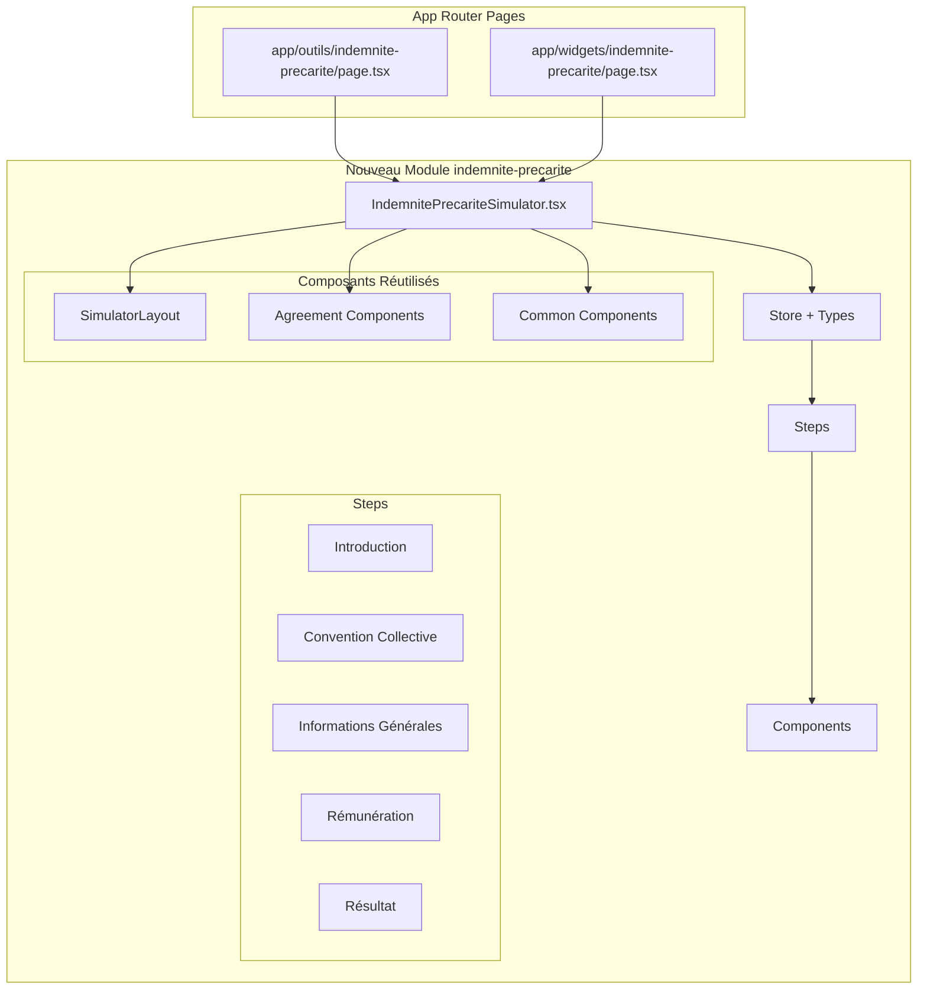

# Plan de Migration - Outil Indemnité de Précarité

## 📋 Contexte

L'outil "indemnité de précarité" existe actuellement dans l'ancienne architecture (Pages Router) et doit être migré vers la nouvelle architecture App Router. Suite aux instructions, un **nouveau module spécifique** [`src/modules/outils/indemnite-precarite`](packages/code-du-travail-frontend/src/modules/outils/indemnite-precarite) sera créé plutôt que d'intégrer dans le module existant [`indemnite-depart`](packages/code-du-travail-frontend/src/modules/outils/indemnite-depart).

## 🎯 Objectifs

1. Créer un nouveau module [`indemnite-precarite`](packages/code-du-travail-frontend/src/modules/outils/indemnite-precarite) dans [`src/modules/outils/`](packages/code-du-travail-frontend/src/modules/outils/)
2. Migrer l'outil vers App Router avec la nouvelle architecture
3. Réutiliser les composants communs des autres modules
4. Maintenir toutes les fonctionnalités existantes
5. Assurer la compatibilité avec les widgets

## 📊 Architecture du Nouveau Module



## 🗂️ Structure Complète des Fichiers

### Nouveau Module à Créer

```
packages/code-du-travail-frontend/src/modules/outils/indemnite-precarite/
├── IndemnitePrecariteSimulator.tsx             # Simulateur principal
├── index.tsx                                   # Export principal
├── store.ts                                    # Store Zustand
├── types.ts                                    # Types spécifiques
├── __tests__/                                  # Tests
│   ├── IndemnitePrecariteSimulator.test.tsx
│   └── __snapshots__/
├── agreements/                                 # Logique conventions collectives
│   ├── index.ts
│   └── supported.ts
├── common/                                     # Composants communs
│   ├── components/
│   └── utils/
├── events/                                     # Événements analytics
│   └── index.ts
└── steps/                                      # Étapes du simulateur
    ├── index.ts
    ├── Introduction.tsx
    ├── ConventionCollective.tsx
    ├── InfosGenerales.tsx
    ├── Remuneration.tsx
    └── Resultat.tsx
```

### Pages App Router à Créer

```
packages/code-du-travail-frontend/
├── app/outils/indemnite-precarite/
│   └── page.tsx                                # Page principale
└── app/widgets/indemnite-precarite/
    └── page.tsx                                # Widget
```

## 📝 Étapes Détaillées de Migration

### Phase 1 : Analyse et Préparation

#### 1.1 Analyser l'Implémentation Actuelle

- **Fichiers à analyser** :
  - [`src/outils/IndemnitePrecarite/index.tsx`](packages/code-du-travail-frontend/src/outils/IndemnitePrecarite/index.tsx)
  - [`src/outils/IndemnitePrecarite/stepReducer.tsx`](packages/code-du-travail-frontend/src/outils/IndemnitePrecarite/stepReducer.tsx)
  - [`src/outils/IndemnitePrecarite/steps/`](packages/code-du-travail-frontend/src/outils/IndemnitePrecarite/steps/)
  - [`src/outils/IndemnitePrecarite/components/`](packages/code-du-travail-frontend/src/outils/IndemnitePrecarite/components/)

#### 1.2 Identifier les Composants Réutilisables

- Analyser les modules [`preavis-demission`](packages/code-du-travail-frontend/src/modules/outils/preavis-demission) et [`preavis-retraite`](packages/code-du-travail-frontend/src/modules/outils/preavis-retraite)
- Identifier les composants communs dans [`src/modules/outils/common/`](packages/code-du-travail-frontend/src/modules/outils/common/)

### Phase 2 : Création du Nouveau Module

#### 2.1 Créer la Structure de Base

- **Créer** : [`src/modules/outils/indemnite-precarite/types.ts`](packages/code-du-travail-frontend/src/modules/outils/indemnite-precarite/types.ts)

  ```typescript
  export interface IndemnitePrecariteData {
    // Types spécifiques à l'indemnité de précarité
    contractType?: string;
    conventionCollective?: Agreement;
    salaryInfo?: SalaryInfo;
    contractDuration?: number;
    // ... autres types nécessaires
  }

  export enum IndemnitePrecariteStepName {
    Introduction = "start",
    ConventionCollective = "info_cc",
    InfosGenerales = "info_generales",
    Remuneration = "remuneration",
    Resultat = "results",
  }

  export interface SalaryInfo {
    monthlySalary?: number;
    variablePart?: number;
    // ... autres informations salariales
  }
  ```

#### 2.2 Créer le Store

- **Créer** : [`src/modules/outils/indemnite-precarite/store.ts`](packages/code-du-travail-frontend/src/modules/outils/indemnite-precarite/store.ts)

  - Utiliser Zustand comme les autres modules
  - Adapter la logique du [`stepReducer`](packages/code-du-travail-frontend/src/outils/IndemnitePrecarite/stepReducer.tsx) existant

  ```typescript
  import { create } from "zustand";
  import { IndemnitePrecariteData, IndemnitePrecariteStepName } from "./types";

  interface IndemnitePrecariteStore extends IndemnitePrecariteData {
    currentStep: IndemnitePrecariteStepName;
    isStepValid: (step: IndemnitePrecariteStepName) => boolean;
    setCurrentStep: (step: IndemnitePrecariteStepName) => void;
    // ... autres méthodes du store
  }
  ```

#### 2.3 Migrer les Steps

- **Créer** : [`src/modules/outils/indemnite-precarite/steps/Introduction.tsx`](packages/code-du-travail-frontend/src/modules/outils/indemnite-precarite/steps/Introduction.tsx)
  - Migrer depuis [`src/outils/IndemnitePrecarite/steps/Introduction.tsx`](packages/code-du-travail-frontend/src/outils/IndemnitePrecarite/steps/Introduction.tsx)
- **Créer** : [`src/modules/outils/indemnite-precarite/steps/ConventionCollective.tsx`](packages/code-du-travail-frontend/src/modules/outils/indemnite-precarite/steps/ConventionCollective.tsx)
  - Migrer depuis [`src/outils/IndemnitePrecarite/steps/AgreementStep.tsx`](packages/code-du-travail-frontend/src/outils/IndemnitePrecarite/steps/AgreementStep.tsx)
- **Créer** : [`src/modules/outils/indemnite-precarite/steps/InfosGenerales.tsx`](packages/code-du-travail-frontend/src/modules/outils/indemnite-precarite/steps/InfosGenerales.tsx)
  - Migrer depuis [`src/outils/IndemnitePrecarite/steps/StepInfosGenerales.tsx`](packages/code-du-travail-frontend/src/outils/IndemnitePrecarite/steps/StepInfosGenerales.tsx)
- **Créer** : [`src/modules/outils/indemnite-precarite/steps/Remuneration.tsx`](packages/code-du-travail-frontend/src/modules/outils/indemnite-precarite/steps/Remuneration.tsx)
  - Migrer depuis [`src/outils/IndemnitePrecarite/steps/StepRemuneration.tsx`](packages/code-du-travail-frontend/src/outils/IndemnitePrecarite/steps/StepRemuneration.tsx)
- **Créer** : [`src/modules/outils/indemnite-precarite/steps/Resultat.tsx`](packages/code-du-travail-frontend/src/modules/outils/indemnite-precarite/steps/Resultat.tsx)
  - Migrer depuis [`src/outils/IndemnitePrecarite/steps/StepIndemnite.tsx`](packages/code-du-travail-frontend/src/outils/IndemnitePrecarite/steps/StepIndemnite.tsx)

### Phase 3 : Créer le Simulateur Principal

#### 3.1 Simulateur Principal

- **Créer** : [`src/modules/outils/indemnite-precarite/IndemnitePrecariteSimulator.tsx`](packages/code-du-travail-frontend/src/modules/outils/indemnite-precarite/IndemnitePrecariteSimulator.tsx)

  ```typescript
  import React from 'react';
  import { SimulatorLayout } from '../common/components/SimulatorLayout';
  import { Step } from '../common/components/SimulatorLayout/types';
  import { IndemnitePrecariteStepName } from './types';
  import { useIndemnitePrecariteStore } from './store';

  interface Props {
    title: string;
    displayTitle: string;
    relatedItems?: any[];
  }

  const IndemnitePrecariteSimulator = ({ title, displayTitle, relatedItems }: Props) => {
    // Logique du simulateur utilisant SimulatorLayout
    const steps: Step<IndemnitePrecariteStepName>[] = [
      // Définition des steps
    ];

    return (
      <SimulatorLayout
        title={title}
        steps={steps}
        // ... autres props
      />
    );
  };

  export default IndemnitePrecariteSimulator;
  ```

#### 3.2 Export Principal

- **Créer** : [`src/modules/outils/indemnite-precarite/index.tsx`](packages/code-du-travail-frontend/src/modules/outils/indemnite-precarite/index.tsx)
  ```typescript
  export { default as IndemnitePrecariteSimulator } from "./IndemnitePrecariteSimulator";
  export * from "./types";
  export * from "./store";
  ```

### Phase 4 : Créer les Pages App Router

#### 4.1 Page Principale

- **Créer** : [`app/outils/indemnite-precarite/page.tsx`](packages/code-du-travail-frontend/app/outils/indemnite-precarite/page.tsx)

  ```typescript
  import { DsfrLayout } from "../../../src/modules/layout";
  import { fetchRelatedItems } from "../../../src/modules/documents";
  import { fetchTool } from "../../../src/modules/outils";
  import { notFound } from "next/navigation";
  import { generateDefaultMetadata } from "../../../src/modules/common/metas";
  import IndemnitePrecariteSimulator from "../../../src/modules/outils/indemnite-precarite/IndemnitePrecariteSimulator";

  export async function generateMetadata() {
    const { metaTitle, metaDescription } = await getTool();

    return generateDefaultMetadata({
      title: metaTitle,
      description: metaDescription,
      path: `/outils/indemnite-precarite`,
    });
  }

  async function IndemnitePrecarite() {
    const tool = await getTool();
    const relatedItems = await fetchRelatedItems(
      { _id: tool._id },
      "indemnite-precarite"
    );
    return (
      <DsfrLayout>
        <IndemnitePrecariteSimulator
          title={tool.title}
          displayTitle={tool.displayTitle}
          relatedItems={relatedItems}
        />
      </DsfrLayout>
    );
  }

  const getTool = async () => {
    const tool = await fetchTool("indemnite-precarite");

    if (!tool) {
      return notFound();
    }
    return tool;
  };

  export default IndemnitePrecarite;
  ```

#### 4.2 Page Widget

- **Créer** : [`app/widgets/indemnite-precarite/page.tsx`](packages/code-du-travail-frontend/app/widgets/indemnite-precarite/page.tsx)

  ```typescript
  import { DsfrLayout } from "../../../src/modules/layout";
  import { fetchRelatedItems } from "../../../src/modules/documents";
  import { fetchTool } from "../../../src/modules/outils";
  import { notFound } from "next/navigation";
  import { generateDefaultMetadata } from "../../../src/modules/common/metas";
  import IndemnitePrecariteSimulator from "../../../src/modules/outils/indemnite-precarite/IndemnitePrecariteSimulator";

  // Structure similaire à la page principale mais adaptée pour les widgets
  ```

### Phase 5 : Migration des Fonctionnalités Spécifiques

#### 5.1 Logique des Conventions Collectives

- **Créer** : [`src/modules/outils/indemnite-precarite/agreements/index.ts`](packages/code-du-travail-frontend/src/modules/outils/indemnite-precarite/agreements/index.ts)
  - Migrer [`getSupportedCCWithoutConventionalProvision`](packages/code-du-travail-frontend/src/outils/IndemnitePrecarite/steps/situation.js)
  ```typescript
  export const getSupportedCCWithoutConventionalProvision = () => {
    // Logique migrée depuis l'ancien système
  };
  ```

#### 5.2 Calculs et Logique Métier

- **Créer** : [`src/modules/outils/indemnite-precarite/common/utils/calculations.ts`](packages/code-du-travail-frontend/src/modules/outils/indemnite-precarite/common/utils/calculations.ts)
  - Migrer [`indemnite.js`](packages/code-du-travail-frontend/src/outils/IndemnitePrecarite/indemnite.js)
  - Adapter pour TypeScript et la nouvelle architecture

#### 5.3 Événements Analytics

- **Créer** : [`src/modules/outils/indemnite-precarite/events/index.ts`](packages/code-du-travail-frontend/src/modules/outils/indemnite-precarite/events/index.ts)
  - Migrer les événements de tracking depuis l'ancien système

### Phase 6 : Tests et Validation

#### 6.1 Migrer les Tests

- **Créer** : [`src/modules/outils/indemnite-precarite/__tests__/IndemnitePrecariteSimulator.test.tsx`](packages/code-du-travail-frontend/src/modules/outils/indemnite-precarite/__tests__/IndemnitePrecariteSimulator.test.tsx)
- **Migrer** : Tous les tests existants de [`src/outils/IndemnitePrecarite/__tests__/`](packages/code-du-travail-frontend/src/outils/IndemnitePrecarite/__tests__/)
  - Tests par convention collective (1090.test.tsx, 2596.test.tsx, etc.)
  - Tests d'erreur (3127-error.test.tsx, 1516-error.test.tsx, etc.)
  - Test principal (index.test.tsx)

#### 6.2 Tests d'Intégration

- Tester les pages App Router
- Vérifier les widgets
- Valider les calculs avec les mêmes données que l'ancien système

### Phase 7 : Nettoyage et Finalisation

#### 7.1 Supprimer l'Ancienne Implémentation

- **Supprimer** : [`src/outils/IndemnitePrecarite/`](packages/code-du-travail-frontend/src/outils/IndemnitePrecarite/) (tout le dossier)
- **Modifier** : [`pages/outils/[slug].tsx`](packages/code-du-travail-frontend/pages/outils/[slug].tsx) - Retirer la référence `"indemnite-precarite": SimulateurIndemnitePrecarite`
- **Modifier** : [`pages/widgets/[slug].tsx`](packages/code-du-travail-frontend/pages/widgets/[slug].tsx) - Retirer la référence `"indemnite-precarite": SimulateurIndemnitePrecarite`

#### 7.2 Mise à Jour des Références

- Vérifier toutes les références dans le code
- Mettre à jour les imports si nécessaire
- Vérifier les fichiers de configuration (cypress, etc.)

## 🔧 Points d'Attention Spécifiques

### Réutilisation de Composants

- **SimulatorLayout** : Utiliser [`SimulatorLayout`](packages/code-du-travail-frontend/src/modules/outils/common/components/SimulatorLayout) du module commun
- **Convention Collective** : Réutiliser les composants de convention collective des autres modules
- **Formulaires** : Adapter les composants de formulaire existants

### Logique Métier Spécifique

- **Calculs** : L'indemnité de précarité a des règles de calcul spécifiques (10% du salaire brut total)
- **Conventions Collectives** : Certaines conventions collectives ont des dispositions particulières
- **Exclusions** : Les cas d'exclusion doivent être préservés (CDD de remplacement, etc.)

### Compatibilité

- **Widgets** : Maintenir la compatibilité avec les widgets existants
- **URLs** : Préserver les URLs existantes (`/outils/indemnite-precarite`)
- **Analytics** : Conserver les événements analytics existants

### Migration des Données

- **Types de contrat** : CDD classique, CDD d'usage, intérim, etc.
- **Situations particulières** : Renouvellement, proposition CDI, etc.
- **Calculs complexes** : Primes, avantages en nature, etc.

## ✅ Critères de Validation

### Fonctionnel

- [ ] Tous les calculs produisent les mêmes résultats que l'ancien système
- [ ] Toutes les conventions collectives supportées fonctionnent
- [ ] Les cas d'exclusion sont correctement gérés
- [ ] Les messages d'erreur sont appropriés

### Interface Utilisateur

- [ ] L'interface utilisateur est identique ou améliorée
- [ ] La navigation entre les étapes fonctionne correctement
- [ ] Les formulaires sont validés correctement
- [ ] Les résultats sont affichés clairement

### Performance

- [ ] Les temps de chargement sont maintenus ou améliorés
- [ ] Les transitions entre étapes sont fluides
- [ ] Le bundle JavaScript n'est pas significativement plus lourd

### Tests

- [ ] Tous les tests unitaires passent
- [ ] Les tests d'intégration passent
- [ ] Les tests Cypress passent
- [ ] La couverture de code est maintenue

### Accessibilité et SEO

- [ ] Les standards d'accessibilité sont respectés
- [ ] Les métadonnées et URLs sont correctes
- [ ] Le référencement n'est pas impacté

### Compatibilité

- [ ] Les widgets fonctionnent correctement
- [ ] L'intégration externe n'est pas cassée
- [ ] Les événements analytics sont correctement envoyés

## 📋 Checklist de Migration

### Phase 1 - Analyse ✅

- [ ] Analyser l'implémentation actuelle
- [ ] Identifier les composants réutilisables
- [ ] Documenter les spécificités métier

### Phase 2 - Structure ✅

- [ ] Créer la structure de fichiers
- [ ] Définir les types TypeScript
- [ ] Créer le store Zustand

### Phase 3 - Steps ✅

- [ ] Migrer Introduction
- [ ] Migrer Convention Collective
- [ ] Migrer Informations Générales
- [ ] Migrer Rémunération
- [ ] Migrer Résultat

### Phase 4 - Simulateur ✅

- [ ] Créer le simulateur principal
- [ ] Intégrer SimulatorLayout
- [ ] Configurer les steps

### Phase 5 - Pages ✅

- [ ] Créer page App Router principale
- [ ] Créer page App Router widget
- [ ] Tester les métadonnées

### Phase 6 - Logique Métier ✅

- [ ] Migrer calculs d'indemnité
- [ ] Migrer logique conventions collectives
- [ ] Migrer événements analytics

### Phase 7 - Tests ✅

- [ ] Migrer tests unitaires
- [ ] Créer tests d'intégration
- [ ] Valider avec tests Cypress

### Phase 8 - Nettoyage ✅

- [ ] Supprimer ancien code
- [ ] Nettoyer les références
- [ ] Valider la migration complète

---

## 🚀 Prêt pour l'Implémentation

Ce plan détaillé fournit une roadmap complète pour migrer l'outil indemnité de précarité vers la nouvelle architecture. Chaque étape est documentée avec les fichiers à créer, modifier ou supprimer, ainsi que des exemples de code pour guider l'implémentation.

La migration suivra les mêmes patterns que les outils déjà migrés (préavis de démission et préavis de retraite) tout en préservant les spécificités de l'indemnité de précarité.
