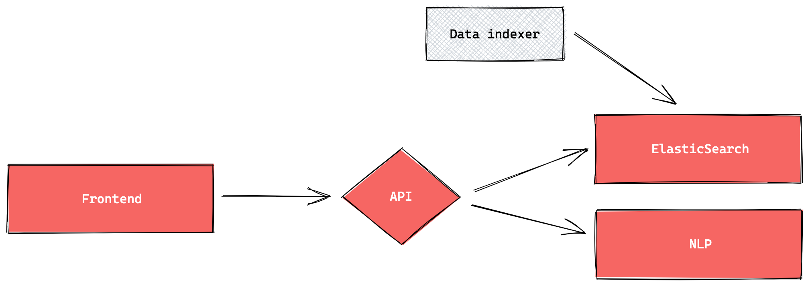

# Code du travail numérique - dev

[](https://travis-ci.com/SocialGouv/code-du-travail-numerique)
[](https://codecov.io/gh/SocialGouv/code-du-travail-numerique)
[](https://app.fossa.io/projects/git%2Bgithub.com%2FSocialGouv%2Fcode-du-travail-numerique?ref=badge_shield)

<br/><br/>



<br/><br/>

## URLs

### Demos

- Production : <https://code.travail.gouv.fr>
- master (dev) : <https://master-dev-code-du-travail-numerique.dev.fabrique.social.gouv.fr/>

## Installation

Make sure you're using NodeJS 14.17.4+.

```sh
# Install all the packages
yarn
yarn build
```

Note: environment file can be created using [scripts/setup-env.js](scripts/setup-env.js)) according to `NODE_ENV`, default to `dev`

### Dev

#### Packages

| Package                                                              | description                                   |
| -------------------------------------------------------------------- | --------------------------------------------- |
| [code-du-travail-api](./packages/code-du-travail-api)                | NodeJS koa API                                |
| [code-du-travail-data](./packages/code-du-travail-data)              | Elastic indexing scripts                      |
| [code-du-travail-frontend](./packages/code-du-travail-frontend)      | Next.js frontend application                  |
| [react-ui](./packages/react-ui)                                      | React components and styleguide               |
| [react-fiches-service-public](./packages/react-fiche-service-public) | React components for fiches service-public.fr |

#### Frontend

Run the frontend with our online latest API :

```sh
yarn dev:frontend:preprod-api
```

If you need to work on both frontend and api, don't provide API_URL as it will fallback to `http://localhost:1337/api/v1`

```sh
yarn dev:frontend
```

The React components are defined in the [react-ui](./packages/react-ui) package and showcased here: <https://socialgouv-react-ui.netlify.com>

##### Testing

If you want to run e2e test, you have to run the frontend in a dedicated tab before running the tests.

```sh
yarn test:e2e # To run e2e test without any UI
yarn test:e2e:ui # To run e2e test with CodeceptJS UI
```

#### Backend

To run the NodeJS API, you need an Elasticsearch instance.

The provided [docker-compose.yml](./docker-compose.yml) provide all the environment.

We recommend using the `docker-compose.override.dev.yml` config for local development.
Copy/paste and rename the `docker-compose.override.dev.yml` to `docker-compose.override.yml`
(more information on the [docker-compose documentation](https://docs.docker.com/compose/extends/#multiple-compose-files)).

```sh
cp docker-compose.override.dev.yml docker-compose.override.yml
```

```sh
# start elasticsearch
docker-compose up elasticsearch

# Start API in dev mode : runs on http://localhost:1337
yarn workspace @cdt/api dev
```

## Howto

To launch a local tf-serve instance, you can report to the README of our [serving-ml project](https://github.com/SocialGouv/serving-ml#using-a-tensorflow-model-with-tensorflowserving)

You can also read the packages readme

- [API README](./packages/code-du-travail-api/README.md)
<<<<<<< HEAD
- [e2e README](./optional/e2e/README.md)
=======
- [e2e README](./packages/code-du-travail-frontend-e2e/README.md)
>>>>>>> master

## Contributions

- See [code of conduct](./CODE_OF_CONDUCT.md)
- Work on feature branches
- Make [conventional commits](https://github.com/conventional-changelog/conventional-changelog)

### Issues

- Issues GitHub : <https://github.com/SocialGouv/code-du-travail-numerique/issues>
- nomenclature des labels :

  - t : `t`ype of issue
  - p : name of `p`roduct (we differentiate ES and nav by themes for now)
  - s : `s`tatus of the issue
  - o : name of the dedicated t`o`ol

## License

[](https://app.fossa.io/projects/git%2Bgithub.com%2FSocialGouv%2Fcode-du-travail-numerique?ref=badge_large)
