# code-du-travail-data

L'image docker DATA contient un dump des documents ainsi que les vecteurs associés à chaque documents.
Ce fichier est récupéré de l'image [NLP](../code_du_travail_nlp/README.md#Docker)
Ce document est par la suite utilisé par le container data pour réaliser l'indexation.

## Données

Par defaut, le script d'indexation va chercher les données dans l'arborescence `/packages/code-du-travail-nlp/data` 
mais il possible de changer ce chemin avec la variable d'environnement `DUMP_PATH`.

### Génération en local

Une premiere version du dump (sans les vecteurs) peut être générée via la commande.

```sh
$ yarn workspace @cdt/data -s dump > cdtn.data.json
```

Dans cette version du dump, les documents ne contiennent pas les vecteurs pour la recherche sémantique.
Il faut ensuite lancer le script de dump de l'api nlp pour rajouter les vecteurs.

### Récupération depuis une image

Si vous disposez d'une image nlp sur votre machine vous pouvez copier le fichier de dump complet 
via la commande docker suivante.

```sh
$ docker run --rm --entrypoint cat cdtn_nlp:local  /app/data/dump.tf.json  > dump.data.json
```

## Schéma

[](https://mermaidjs.github.io/mermaid-live-editor/#/edit/eyJjb2RlIjoiZ3JhcGggTFJcbldlZXouY3N2LS0-U2lyZXQySWRjY1tBUEkgU2lyZXQySWRjY11cbkNvbnRyaWJ1dGlvbnMtLT5DT05UUklCXG5DT05UUklCLS0-RkVcblNpcmV0MklkY2MtLT5GRVxuREZbZGF0YWZpbGxlcl1cbkFQSVtBUEkgTm9kZUpTIENEVE5dXG5DW0FQSSBDb250cmlidXRpb25zXVxuRElMQVtBUEkgRElMQSBBSUZFXVxua2FsaS1kYXRhXG5FU1tkYXRhIGJ1aWxkXVxuRVMtLT58cG9wdWxhdGUuanN8RWxhc3RpY1NlYXJjaFxuRElMQS0tPmthbGktZGF0YVxuRElMQS0tPmxlZ2ktZGF0YVxuTVQyLS0-RVNcblNQMi0tPkVTXG5TRFItLT5GRVxuQ09VUlJJRVJTLS0-RVNcbk9VVElMUy0tPkVTXG5GRVtGcm9udGVuZCBDRFROXVxuUFJFQVZJUy0tPlBSRUFWSVMyXG5DLS0-RVNcbnN1YmdyYXBoIEdJVCBDRFROXG5QUkVBVklTMltwcmVhdmlzLmRhdGEuanNvbl1cbkNPVVJSSUVSU1tleHBvcnQtY291cnJpZXJzLmpzb25dXG5DT05UUklCW2NvbnRyaWJ1dGlvbnMuZGF0YS5qc29uXVxuT1VUSUxTW291dGlscy5qc29uXVxuU1AyW2ZpY2hlcy1zcC5qc29uXVxuTVQyW2ZpY2hlcy1tdC5qc29uXVxuU0RSW3NlcnZpY2VzLWRlLXJlbnNlaWduZW1lbnQuanNvbl1cbkRGQVtkYXRhZmlsbGVyL3ByZXF1YWxpZmllZC5kYXRhLmpzb25dXG5ERkJbZGF0YWZpbGxlci90aGVtZXMuZGF0YS5qc29uXVxuREZDW2RhdGFmaWxsZXIvZ2xvc3NhaXJlLmRhdGEuanNvbl1cbkRGRFtkYXRhZmlsbGVyL2Fuc3dlcnMuZGF0YS5qc29uXVxuU1lOW3N5bm9ueW1lcy5qc29uXVxuU1RQW3N0b3B3b3Jkcy5qc29uXVxuZW5kXG5ERkMtLT5GRVxuREYtLT58cmVxdWV0ZXN8REZBXG5ERi0tPnx0aGVtZXN8REZCXG5ERi0tPnxnbG9zc2FpcmV8REZDXG5ERi0tPnxleGNsdXNpb25zfERGRFxuUFJFQVZJU1tHRG9jIHByw6lhdmlzIGTDqW1pc3Npb25dXG5ERkEtLT5BUElcbkRGQi0tPkVTXG5ERkMtLT5FU1xuREZELS0-QVBJXG5rYWxpLWRhdGFbc29jaWFsZ291di9rYWxpLWRhdGFdLS0-RVNcbmxlZ2ktZGF0YVtzb2NpYWxnb3V2L2xlZ2ktZGF0YV0tLT5FU1xuU1Bbc29jaWFsZ291di9maWNoZXMtdmRkXS0tPlNQMlxuTVRbU2l0ZSBNVF0tLT58c2NyYXBpbmd8TVQyXG5FUy0tPnxkdW1wLmpzfER1bXBbZHVtcC5kYXRhLmpzb25dXG5ERkItLT58c2l0ZW1hcHxGRVxuRHVtcC0tPk5MUFtBcGkgTkxQXVxuc3VnZ2VzdGVyLmRhdGEudHh0LS0-TkxQXG5FbGFzdGljU2VhcmNoLS0-QVBJXG5TWU4tLT5FbGFzdGljU2VhcmNoXG5TVFAtLT5FbGFzdGljU2VhcmNoXG5OTFAtLT5BUEkiLCJtZXJtYWlkIjp7InRoZW1lIjoiZGVmYXVsdCJ9fQ)
